前： [Pod](Pod.md)

---

# Podの管理

Podはそれ自体によって自動復旧しません。
もしノードのリソース不足や何らかの障害などで、Podが停止や削除された場合、自動復旧は行われません。
またPodにはスケールアウトの機能はありません。
例えば、負荷分散のためにNginxが起動するPodを複数作成したい場合、
人の手でPodを複数作成する必要があります。

これでは実運用としては問題です。このような問題を解決するために、
`複数のPodを作成・管理し、レプリケーションやスケールアウト、自動復旧`といった機能を提供する
 `Pod Controller`と呼ばれるAPIリソース群がK8sには用意されています。

Pod Controllerには次のようなものがあります。
（全てWorkloads APIsのカテゴリに所属します。）

- ReplicaSet
- Deployment
- StatefulSet
- DaemonSet

この章では、ReplicaSetおよびDeploymentについて解説します。
（StatefulSetとDaemonSetは中級で扱います。）

## ReplicaSet

ReplicaSetはPodのレプリカを作成し、指定した数のPodを`維持し続ける`APIリソースです。
Podのテンプレートと作成する数量を定義します。

次のmanifestはReplicaSetのサンプルです。
このサンプルでは、Nginxが起動するPodを`3つ`起動し、その状態を維持し続けます。

障害などの何らかの理由でPodの数が指定した数とずれた場合、自動的に指定した状態に修正してくれます。
ReplicaSetを使用することで、Podの`自動復旧`が可能になります。

ただし、このReplicaSetを実際に作成することは多くありません。
次に説明するDeploymentを介して使用することが多いためです。

```yml
apiVersion: apps/v1
kind: ReplicaSet
metadata:
  name: frontend
  labels:
    app: web
spec:
  replicas: 3
  selector:
    matchLabels:
      app: web
  template:
    metadata:
      labels:
        app: web
    spec:
      containers:
      - name: nginx
        image: nginx:1.22
```

## Deployment

Deploymentは複数のReplicaSetを管理することで、
ローリングアップデートやロールバックなどの機能を実現するAPIリソースです。

DeploymentがReplicaSetを管理し、ReplicaSetがPodを管理するという３層構造になっています。



Deploymentは次のような動作をします。

1. 新しいReplicaSetを作成する
1. 新しいReplicaSetにPod(v2)を徐々に増やし、最終的にPodの数をReplica数にする
1. 古いReplicaSetにあるPod(v1)を徐々に減らし、最終的にPodの数を0にする
   ※古いReplicaSetはロールバックのために削除されず、一定数保持されます。

Deploymentを使用すると、これらの動作をK8s側で自動的に行ってくれます。
これによりサービス無停止でのローリングアップデートが容易に実現可能になります。



K8sではもっとも推奨されているコンテナの起動方法です。
たとえ１つのコンテナを起動するだけであっても、自動復旧やローリングアップデートの機能を使用するため、Deploymentを使用することが多いです。

## チュートリアル1: Deploymentを作ってみる

では実際にDeploymentを作成してみましょう。
次の操作を実施してください。

1. 次のmanifestを使用して、Deployment:nginxを作成する。

   ``` yml
   apiVersion: apps/v1
   kind: Deployment
   metadata:
     name: nginx
     labels:
       app: nginx
   spec:
     replicas: 1
     selector:
       matchLabels:
         app: test
     template:
       metadata:
         labels:
           app: test
       spec:
         containers:
         - name: nginx
           image: nginx:1.22
       ```

1. Deployment、ReplicaSet、Podそれぞれのオブジェクト一覧を表示する。
1. 作成したnginx-XXXXXXという名前の`Pod`を削除する。(Deploymentは消してはダメ！)
1. Podのオブジェクト一覧を表示する。(さきほどとは違う名前のPodが作成されていることを確認してください)
1. manifestを修正し、Deploymentのreplicasを`2`に修正し、修正を適用する。
1. Podのオブジェクト一覧を表示する。(Podの数が増えていることを確認してください)
1. (次章`Service-Cluster`で作成したDeployment:nginxを使用します。次章を実施しない場合はDeployment:nginxを削除してください。)

## チュートリアル2: ローリングアップデートする

次にコンテナのローリングアップデートをやってみましょう。
nginxのバージョンを1.22から1.23へアップデートします。

1. 次のmanifestを使用して、Deployment:nginx-rollupを作成する。

   ``` yml
   apiVersion: apps/v1
   kind: Deployment
   metadata:
     name: nginx-rollup
     labels:
       app: nginx-rollup
   spec:
     replicas: 2
     selector:
       matchLabels:
         app: test
     template:
       metadata:
         labels:
           app: test
       spec:
         containers:
         - name: nginx
           image: nginx:1.22
           lifecycle:
             preStop:
               exec:
                 command: ['sh', '-c', 'sleep 30']
         initContainers:
         - name: busybox
           image: busybox:1.28
           command: ['sh', '-c', 'sleep 30']
    ```

1. Deployment、ReplicaSet、Podそれぞれのオブジェクト一覧を表示する。

1. manifestの`nginx:1.22`を`nginx:1.23`へと修正し、修正を適用する。

1. Deployment、ReplicaSet、Podそれぞれのオブジェクト一覧を繰り返し表示する。（順番にPodが再作成されることを確認してください。）

1. Deployment:nginx-rollupを削除する。

以上で本チュートリアルは終了です。

具体的な操作およびその結果に関する回答例は[こちら](../ans/Deployment_answer.md)にあります。
具体的な操作方法がわからなかった場合や、想定した結果にならなかった場合などに参照してください。

---

次： [Service-ClusterIP](Service-ClusterIP.md)
