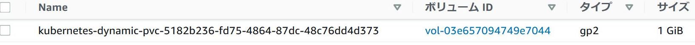

# 回答例

1. 以下を満たすマニフェストを作成しデプロイしてください。PVCは[公式ドキュメント][1]を参考にしてください。

   - 要件
     - PersistentVolumeClaim
       - 名前は`nfs-server-pvc`
       - storageClassNameは`指定しない`（デフォルトのStorageClassを使用する）
       - accessModesは`ReadWriteOnce`
       - ストレージ容量は`1Gi`

   【回答例】

   ```yaml
   # manifest
   apiVersion: v1
   kind: PersistentVolumeClaim
   metadata:
     name: nfs-server-pvc
     namespace: nfs
   spec:
     accessModes:
     - ReadWriteOnce
     resources:
       requests:
         storage: 1Gi
   ```

   ```bash
   # 実行結果
   $ kubectl apply -f nfs-server-pvc.yaml
   namespace/nfs created
   persistentvolumeclaim/nfs-server-pvc created
   ```

1. PVCリソースのオブジェクト一覧を確認してください。

   【回答例】

   ```bash
   # 実行結果
   $ kubectl get persistentvolumeclaims -n nfs (kubectl get pvc -n nfs でも可)
   NAME                    STATUS    VOLUME   CAPACITY   ACCESS MODES   STORAGECLASS   AGE
   nfs-server-pvc   Pending                                      gp2            5m40s
   ```

1. 以下を満たすマニフェストを作成しデプロイしてください。

   - 要件
     - Deployment
       - 名前は`nfs-server`
       - replicas: `1`
       - labelはすべて`role: nfs-server`
       - Pod
         - containerは一つでイメージは`k8s.gcr.io/volume-nfs:0.8`
         - volumeプラグインでPVC:`nfs-server-pvc`を指定
         - 上記で定義したボリュームをコンテナの`/exports`にマウント

   【回答例】

   ```yml
   # manifest
   apiVersion: apps/v1
   kind: Deployment
   metadata:
     name: nfs-server
     namespace: nfs
   spec:
     replicas: 1
     selector:
       matchLabels:
         role: nfs-server
     template:
       metadata:
         labels:
           role: nfs-server
       spec:
         containers:
         - name: nfs-server
           image: k8s.gcr.io/volume-nfs:0.8
           volumeMounts:
           - mountPath: /exports
             name: nfs-server-pvc
         volumes:
           - name: nfs-server-pvc
             persistentVolumeClaim:
               claimName: nfs-server-pvc
   ```

   ```bash
   # 実行結果
   $ kc apply -f nfs-server.yaml
   deployment.apps/nfs-server created
   ```

1. PVCリソースのオブジェクト一覧を確認してください。

   【回答例】

   ```bash
   # 実行結果
   $ kubectl get pvc
   NAME                    STATUS   VOLUME                                     CAPACITY   ACCESS MODES   STORAGECLASS   AGE
   nfs-server-pvc   Bound    pvc-5182b236-fd75-4864-87dc-48c76dd4d373   1Gi        RWO            gp2            2m24s
   ```

1. PVリソースのオブジェクト一覧を確認してください。

   【回答例】

   ```bash
   # 実行結果
   $ kubectl get pv
   NAME                                       CAPACITY   ACCESS MODES   RECLAIM POLICY   STATUS   CLAIM                              STORAGECLASS   REASON   AGE
   pvc-5182b236-fd75-4864-87dc-48c76dd4d373   1Gi        RWO            Delete           Bound    nfs/nfs-server-pvc   gp2                     2m10s
   ```

1. AWSのマネジメントコンソールなどでEBSボリュームを確認し「kubernetes-dynamic-pvc-」から始まる名前のボリュームが作成されていることを確認してください。  
   (dvpによってEBSボリュームが自動作成されることを確認します)

   【回答例】

   

1. Deployment, Podのオブジェクト一覧を表示し、`nfs-server`を含んだDeployment, Podが作成されていることを確認してください。

   【回答例】

   ```bash
   # 実行結果
   # Deployment
   $ kubectl get deployment
   NAME                READY   UP-TO-DATE   AVAILABLE   AGE
   nfs-server   1/1     1            1           4m43s

   # Pod
   $ kubectl get pod -n nfs
   NAME                               READY   STATUS    RESTARTS   AGE
   nfs-server-88bd64f7-7w865   1/1     Running   0          4m58s
   ```

1. 作成したリソースを削除してください。

   【回答例】

   ```bash
   # 実行結果
   $ kubectl delete -f nfs-server.yaml
   deployment.apps/nfs-server deleted

   $ kubectl delete -f nfs-server-pvc.yaml
   persistentvolumeclaim/nfs-server-pvc deleted
   ```

[1]:https://kubernetes.io/docs/concepts/storage/persistent-volumes/#persistentvolumeclaims
