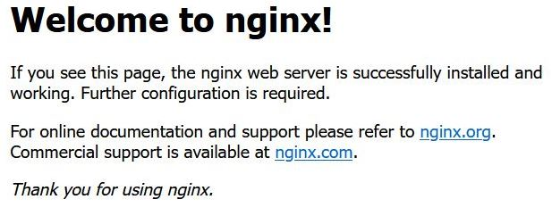
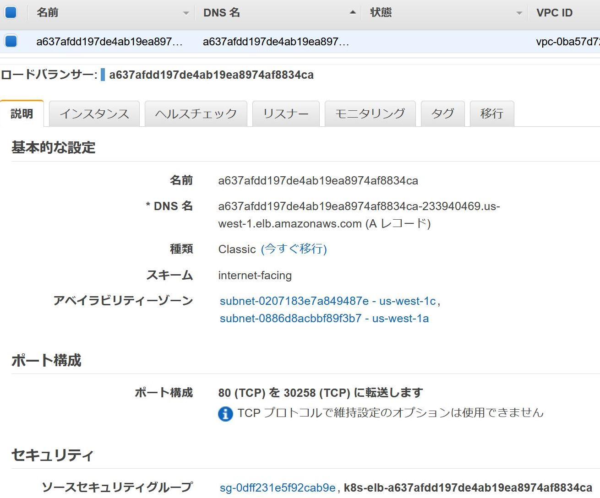
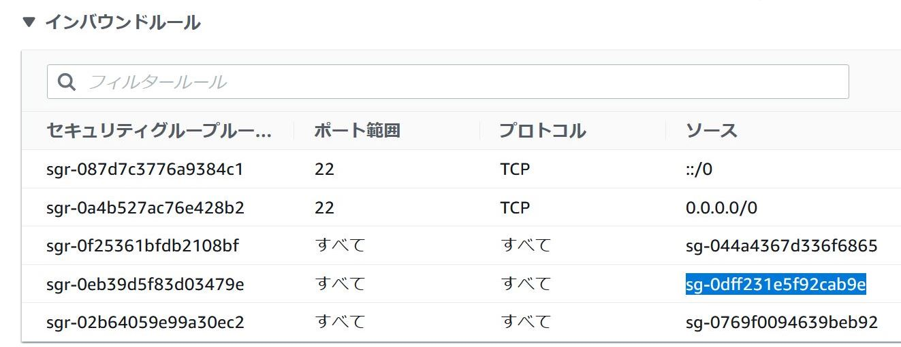
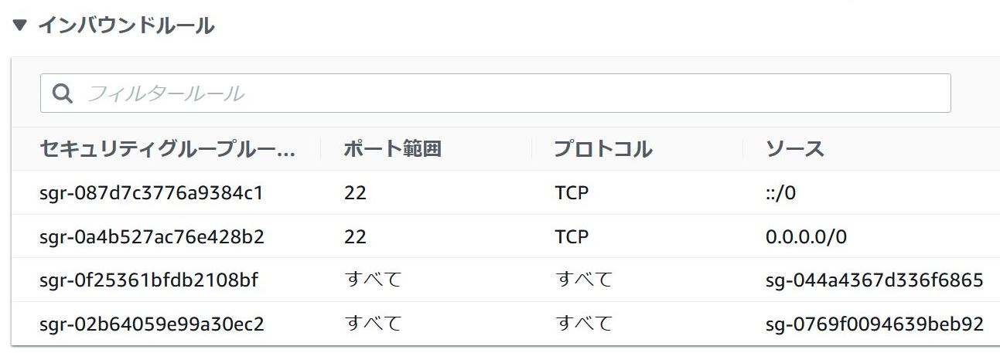

# 回答例

1. 以下を満たすDeployment, Serviceをデプロイしてください。Service Type:LoadBalancerについては[公式ドキュメント][1]を参考にしてください。

   - 要件
     - Deployment
       - 名前は`nginx`
       - replicas: `1`
       - labelはすべて`app: nginx`
       - Pod
         - 名前は`nginx`
         - イメージは`nginx:1.12`
     - Service
       - 名前は`nginx-svc`
       - Namespaceは`web`
       - 対象のlabelは`app: nginx`
       - プロトコルは`TCP`
       - Portは`80`
       - clusterIPは`指定なし`で良い
       - typeは`LoadBalancer`

   【回答例】

   ```yml
   # manifest
   apiVersion: apps/v1
   kind: Deployment
   metadata:
     name: nginx
   spec:
     replicas: 1
     selector:
       matchLabels:
         app: nginx
     template:
       metadata:
         labels:
           app: nginx
       spec:
         containers:
         - name: nginx
           image: nginx:1.12
   ---
   apiVersion: v1
   kind: Service
   metadata:
     name: nginx-svc
   spec:
     type: LoadBalancer
     ports:
       - name: "http-port"
         protocol: "TCP"
         port: 80
         targetPort: 80
     selector:
       app: nginx
   ```

   ```bash
   # 実行結果
   $ kubectl apply -f nginx-svc.yaml
   deployment.apps/nginx created
   service/nginx-svc created
   ```

1. Serviceリソースの一覧を表示しデプロイしたnginx-svcの`EXTERNAL-IP`を確認してください。（あとで使うのでメモしておく）

   【回答例】

   ```bash
   # 実行結果
   $ kubectl get svc
   NAME                   TYPE           CLUSTER-IP          EXTERNAL-IP                                                              PORT   (S)        AGE
   nginx-svc        LoadBalancer   10.100.55.176       a637afdd197de4ab19ea8974af8834ca-233940469.us-west-1.elb.amazonaws.com   80:30258/   TCP   7s
   nginx-service   ClusterIP      10.100.170.132      <none>                                                                   80/   TCP         109s
   ```

1. インターネット接続可能な端末のwebブラウザからさきほど確認したnginx-svcのEXTERNAL-IPにアクセスしてください。  
  （AWSの場合、ELBが使用可能になるまで2分くらいかかる。最初はエラーになるので何度かアクセスしてみる。最長でも5分くらいすればアクセス可能になる。）

   【回答例】

   

1. AWSマネジメントコンソールなどでELBを確認し、EXTERNAL-IPと同じDNS名を持つclassicのLBがデプロイされていることを確認してください。また、LBにアタッチされたsecurity group名を確認してください。

   【回答例】

   

1. AWSマネジメントコンソールなどでK8sのワーカーにアタッチされているsecurity groupを確認し、LBにアタッチされたsecurity groupからのインバウンドが許可されていることを確認してください。

   【回答例】

   

1. curlを実行できるPodを展開し、Service:lb-svcに`ClusterIP`に対してcurlを実行し、アクセスできることを確認してください。  

   【回答例】

   ```bash
   # 実行結果
   $ kubectl run --image=appropriate/curl --restart=Never -it testpod sh
   / #
   / # curl -L 10.100.55.176
   <!DOCTYPE html>
   <html>
   <head>
       <meta charset="UTF-8" http-equiv="Content-Type" content="text/html" />
       <title>Login</title>
       <script src="/js/validate.js"></script>
       <link rel="stylesheet" type="text/css" href="/css/style.css">
   </head>
   <body>

   <h2>Login</h2>

   <form id="loginForm" action="/login" method="post">

       <p>ID <input type="text" name="username"/></p>
       <p>PW <input type="password" name="password" /></p>
       <input type="hidden" name="${_csrf.parameterName}" value="${_csrf.token}" />
       <button type="submit">Login</button>
   </form>

   </body>
   </html>

   / # exit
   ```

1. 作成したリソースを削除してください。

   【回答例】

   ```bash
   # 実行結果
   $ kubectl delete -f nginx-svc.yaml
   deployment.apps/nginx deleted
   service "nginx-svc" deleted
   ```

1. AWSマネジメントコンソールなどでELBおよびワーカーノードのsecurity groupを確認し、Type:LoadBalancerの設定が消えていることを確認してください。

   【回答例】

   
   

[1]:https://kubernetes.io/docs/concepts/services-networking/service/#loadbalancer
