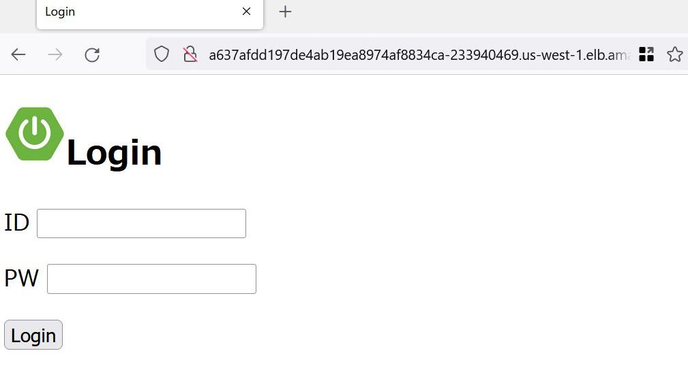

前： [RBAC](RBAC.md)

---

# 章末問題

中級で解説した各種APIリソースを使用して、Spring Bootのデモアプリ[dayan888/springdemo_k8s][1]が稼働する環境を構築します。

[1]:https://github.com/dayan888/springdemo_k8s


## 問題1: NFSサーバ

次の要件を満たすmanifestを作成し、デプロイしてください。

- 要件
  - Namespace
    - 名前は`sbdemo-nfs`
  - PVC
    - 名前は`sbdemo-nfs-server-pvc`
    - Namespaceは`sbdemo-nfs`
    - storageClassNameは`指定しない`（デフォルトのStorageClassを使用する）
    - accessModesは`ReadWriteOnce`
    - ストレージ容量は`1Gi`
  - Deployment
    - 名前は`sbdemo-nfs-server`
    - Namespaceは`sbdemo-nfs`
    - replicas: `1`
    - labelはすべて`role: nfs-server`
    - Pod
      - イメージは`k8s.gcr.io/volume-nfs:0.8`
      - volumeプラグインで上記PVC:`nfs-server-pvc`を指定
      - 上記で定義したボリュームをコンテナの`/exports`にマウント
      - 待ち受けポートは次の通り
        - nfs: 2049
        - mountd: 20048
        - rpcbind: 111
      - securityContextに`privileged: true`を指定
  - Service
    - 名前は`sbdemo-nfs-server-service`
    - Namespaceは`sbdemo-nfs`
    - タイプは指定なし（ClusterIP）
    - 待ち受けポートは次の通り
      - nfs: 2049
      - mountd: 20048
      - rpcbind: 111
    - selectorは`role: nfs-server`
  - PersistentVolume
    - 名前は`sbdemo-nfs-pv`
    - labelはすべて`role: nfs-pv`
    - accessModesは`ReadWriteOnce`
    - ストレージ容量は`1Gi`
    - nfsの設定は次の通り
      - server: <sbdemo-nfs-server-serviceのClusterIP>
      - path: "/"

## 問題2: Redisサーバ

次の要件を満たすmanifestを作成し、デプロイしてください。

- 要件
  - Namespace
    - 名前は`sbdemo-redis`
  - Deployment
    - 名前は`sbdemo-redis`
    - Namespaceは`sbdemo-redis`
    - replicas: `1`
    - labelはすべて`app: sbdemo-redis`
    - Pod
      - 名前は`sbdemo-redis`
      - イメージは`redis:alpine`
      - 待ち受けポートは`6379`
  - Service
    - 名前は`sbdemo-redis-service`
    - Namespaceは`sbdemo-redis`
    - タイプは指定なし（ClusterIP）
    - Protocolは`TCP`
    - 待ち受けポートは`6379`
    - ターゲットポートは`6379`
    - selectorは`app: sbdemo-redis`

## 問題3: DBサーバ

次の要件を満たすmanifestを作成し、デプロイしてください。

- 要件
  - Namespace
    - 名前は`sbdemo-db`
  - StatefulSet
    - 名前は`sbdemo-postgres-sts`
    - Namespaceは`sbdemo-db`
    - labelはすべて`app: sbdemo-postgres-sts`
    - replicasは `3`
    - Pod
      - 名前は`postgres`
      - イメージは`dayan888/springdemo:postgres9.6`
      - 待ち受けポートは`5432`
  - Service
    - 名前は`sbdemo-postgres-service`
    - Namespaceは`sbdemo-db`
    - typeは`ClusterIP`（`明示的に指定する`）
    - clusterIPに`None`
    - Protocolは`TCP`
    - 待ち受けポートは`5432`
    - ターゲットポートは`5432`
    - selectorは`app: sbdemo-postgres-sts`

## 問題4: APサーバ

次の要件を満たすmanifestを作成し、デプロイしてください。

- 要件
  - Namespace
    - 名前は`sbdemo-ap`
  - PersistentVolumeClaim
    - 名前は`sbdemo-nfs-pvc`
    - Namespaceは`spdemo-ap`
    - storageClassNameは`指定しない`
    - selectorは`role: nfs-pv`
    - accessModesは`ReadWriteOnce`
    - ストレージ容量は`1Gi`
  - ConfigMap
    - 名前は`ap-config`
    - Namespaceは`sbdemo-ap`
    - 以下のKey-Valueをdataとして持つ
      - SPRING_PROFILES_ACTIVE: "prd"
      - DB_URL: "jdbc:postgresql://sbdemo-postgres-service.sbodemo-db:5432/demodb?   user=postgres&password=postgres"
      - PIC_DIR: "/opt/picDir"
      - REDIS_HOST: "sbdemo-redis-service.sbdemo-redis"
      - REDIS_PORT: "6379"
  - Deployment
    - Deployment
      - 名前は`sbdemo-apserver`
      - Namespaceは`sbdemo-ap`
      - labelはすべて`app: sbdemo-apserver`
      - replicasは `3`
      - Pod
        - 名前は`apserver`
        - イメージは`dayan888/springdemo:apserver`
        - 待ち受けポートは`8080`
        - env
          - ConfigMap:ap-config
        - volumeプラグインでPVC:`sbdemo-nfs-pvc`を指定
        - 上記で定義したボリュームをコンテナの`/opt/picDir`にマウント
    - Service
      - 名前は`sbdemo-postgres-service`
      - Namespaceは`sbdemo-ap`
      - typeは`ClusterIP`
      - Protocolは`TCP`
      - 待ち受けポートは`8080`
      - ターゲットポートは`8080`
      - selectorは`app: sbdemo-apserver`

## 問題5: WEBサーバ

次の要件を満たすmanifestを作成し、デプロイしてください。

- 要件
  - Namespace
    - 名前は`sbdemo-web`
  - ConfigMap(1つめ)
    - 名前は`nginx-conf`
    - Namespaceは`sbdemo-web`
    - 以下の内容が記述されたnginx.confをdataとして持つ

      ```nginx
      user  nginx;
      worker_processes 1;
      pid        /var/run/nginx.pid;
      events {
          worker_connections 1024;
      }
      http {
          include       /etc/nginx/mime.types;
          default_type  application/octet-stream;
          log_format  main  '$remote_addr - $remote_user [$time_local]  request" '
                            '$status $body_bytes_sent "$http_referer" '
                            '"$http_user_agent" "$http_x_forwarded_for"';
          access_log /dev/stdout;
          error_log  /dev/stderr debug;
          sendfile        on;
          keepalive_timeout  65;
          include /etc/nginx/conf.d/server.conf;
      }
      ```

  - ConfigMap(2つめ)
    - 名前は`server-conf`
    - Namespaceは`sbdemo-web`
    - 以下の内容が記述されたserver.confをdataとして持つ

      ```nginx
      server {
          server_name  springdemo.example.com;
          listen 80;
          location ~* \.(js|jpg|png|css)$ {
              expires 168h;
              root   /usr/share/nginx/html;
          }
          location / {
              proxy_set_header X-Forwarded-Host $host;
              proxy_set_header X-Forwarded-Server $host;
              proxy_set_header X-Forwarded-For $remote_addr;
              proxy_set_header X-Forwarded-Proto $scheme;
              proxy_set_header X-Real-IP $remote_addr;
              proxy_set_header Host $http_host;
              proxy_pass http://sbdemo-apserver-service.sbdemo-ap:8080;
              proxy_cookie_path / /;
          }
          error_page   500 502 503 504  /50x.html;
          location = /50x.html {
              root   /usr/share/nginx/html;
          }
      }
      ```

  - Deployment
    - Deployment
      - 名前は`sbdemo-nginx`
      - Namespaceは`sbdemo-web`
      - labelはすべて`app: sbdemo-nginx`
      - replicasは `3`
      - Pod
        - 名前は`nginx`
        - イメージは`dayan888/springdemo:nginx`
        - 待ち受けポートは`80`
        - ConfigMap:nginx-confを`/etc/nginx/nginx.conf`にマウントする
          - subPath:nginx.conf を設定する
        - ConfigMap:server-confを`/etc/nginx/conf.d/server.conf`にマウントする
          - subPath:server.conf を設定する
    - Service
      - 名前は`sbdemo-nginx-service`
      - Namespaceは`sbdemo-web`
      - typeは`ClusterIP`
      - Protocolは`TCP`
      - 待ち受けポートは`80`
      - ターゲットポートは`80`
      - selectorは`app: sbdemo-nginx`

## 問題6: フロントLoadBalancer

次の要件を満たすmanifestを作成し、デプロイしてください。

- 要件
  - Service
    - 名前は`sbdemo-nginx-lb`
    - Namespaceは`sbdemo-web`
    - 対象のlabelは`app: sbdemo-nginx`
    - プロトコルは`TCP`
    - Portは`80`
    - clusterIPは`指定なし`で良い
    - typeは`LoadBalancer`

## 問題7: 接続確認

インターネット接続可能な端末のwebブラウザからさきほど確認したsbdemo-nginx-lbのEXTERNAL-IPにアクセスしてください。  
問題1～問題6の構築が正常に完了している場合、次のログイン画面が表示されますのでログインしてみましょう。
ログイン情報は`ID/PW=admin/111111`です。



以上で本演習は終了です。

具体的な操作およびその結果に関する回答例は[こちら](../ans/Practice_answer.md)にあります。
具体的な操作方法がわからなかった場合や、想定した結果にならなかった場合などに参照してください。

---

次： [上級](../../3.Advanced/README.md)
