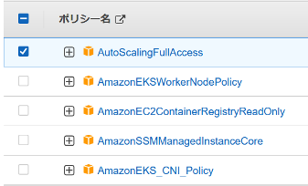
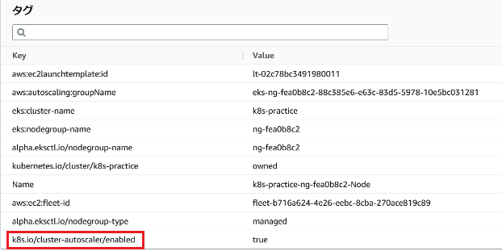
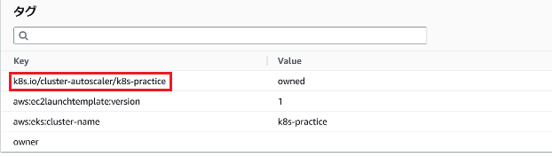

# 回答例

1. ワーカーノードに付与されているIAMロールをマネジメントコンソール等で確認してください。以下のようにAutoScalingGroupの権限が設定されていることを確認してください。設定されていない場合はワーカーノードのIAMロールにポリシーを追加してください。([参考][1])

   ``` json
   {
       "Version": "2012-10-17",
       "Statement": [
           {
               "Effect": "Allow",
               "Action": [
                   "autoscaling:DescribeAutoScalingGroups",
                   "autoscaling:DescribeAutoScalingInstances",
                   "autoscaling:DescribeLaunchConfigurations",
                   "autoscaling:SetDesiredCapacity",
                   "autoscaling:TerminateInstanceInAutoScalingGroup"
               ],
               "Resource": "*"
           }
       ]
   }
   ```

   【回答例】

   

   > :information_source:  
   > ここでは、作業簡略化のため、AWS管理の`AutoScalingFullAccess`を追加しています。

1. AutoScalingGroupのワーカーノードのタグをマネジメントコンソール等で確認してください。以下のタグが付与されていることを確認してください。付与されていない場合は付与してください。なお、タグはKeyの値が重要であり、valueは任意の値で問題ありません。
   - k8s.io/cluster-autoscaler/enabled
   - k8s.io/cluster-autoscaler/<クラスタ名>

   【回答例】

   
   

   > :information_source:  
   > ここでは、クラスタ名を`k8s-practice`としています。

1. [CAのマニフェスト][2]をコピーしてください。

   【回答例】

```bash
# 実行結果
$ wget https://github.com/kubernetes/autoscaler/blob/master/cluster-autoscaler/cloudprovider/aws/examples/cluster-autoscaler-autodiscover.yaml
```

1. 上記でダウンロードしたマニフェストの\<YOUR CLUSTER NAME\>の箇所を修正し、デプロイしてください。

   【回答例】

   ```yml
   # manifest
   ---
      (略)
   ---
   apiVersion: apps/v1
   kind: Deployment
   metadata:
     name: cluster-autoscaler
     namespace: kube-system
     labels:
       app: cluster-autoscaler
      (略)
         containers:
           - image: registry.k8s.io/autoscaling/cluster-autoscaler:v1.22.2
             name: cluster-autoscaler
             resources:
               limits:
                 cpu: 100m
                 memory: 600Mi
               requests:
                 cpu: 100m
                 memory: 600Mi
             command:
               - ./cluster-autoscaler
               - --v=4
               - --stderrthreshold=info
               - --cloud-provider=aws
               - --skip-nodes-with-local-storage=false
               - --expander=least-waste
               - --node-group-auto-discovery=asg:tag=k8s.io/cluster-autoscaler/enabled,k8s.io/cluster-autoscaler/k8s-practice ★
             volumeMounts:
      (略)
   ```

   ```bash
   # 実行結果
   $ kubectl apply -f cluster-autoscaler-autodiscover.yaml
   serviceaccount/cluster-autoscaler created
   clusterrole.rbac.authorization.k8s.io/cluster-autoscaler created
   role.rbac.authorization.k8s.io/cluster-autoscaler created
   clusterrolebinding.rbac.authorization.k8s.io/cluster-autoscaler created
   rolebinding.rbac.authorization.k8s.io/cluster-autoscaler created
   deployment.apps/cluster-autoscaler created
   ```

1. ClusterAutoscalerのPodが起動していることを確認してください。

   【回答例】

   ```bash
   # 実行結果
   $ kubectl get pod -n kube-system | grep cluster-autoscaler
   cluster-autoscaler-bdc5bbf78-7vf2b   1/1     Running   0          53s
   ```

1. 以下を満たすマニフェストを作成しデプロイしてください。
   - Deployment
     - イメージは何でもよい
     - resource.limits.cpu: 1000m

   【回答例】

   ```yml
   # manifest
   apiVersion: apps/v1
   kind: Deployment
   metadata:
     name: nginx
   spec:
     replicas: 1
     selector:
       matchLabels:
         app: nginx
     template:
       metadata:
         labels:
           app: nginx
       spec:
         containers:
           - name: nginx
             image: nginx:1.12
             ports:
               - containerPort: 80
             resources:
               limits:
                 cpu: 1000m
   ```

   ```bash
   # 実行結果
   $ kubectl apply -f ca-nginx.yaml
   deployment.apps/nginx created
   ```

1. 上記作成したDeploymentのreplica数を1つずつ増やし、STATUS:PendingのPodが出るまで続けてください。

   【回答例】

   ```bash
   # 実行結果 (修正前)
   $ kubectl get pod
   NAME                     READY   STATUS    RESTARTS   AGE
   nginx-5c7b8644f5-gwgtc   1/1     Running   0          60s
   ```

   ```bash
   # 実行結果 (修正後)
   $ kubectl apply -f ca-nginx.yaml
   deployment.apps/nginx configured

   $ kubectl get pod
   NAME                     READY   STATUS    RESTARTS   AGE
   nginx-5c7b8644f5-4m2zp   0/1     Pending   0          38s
   nginx-5c7b8644f5-bxbrq   1/1     Running   0          38s
   nginx-5c7b8644f5-gwgtc   1/1     Running   0          60s
   nginx-5c7b8644f5-phhxr   1/1     Running   0          38s
   nginx-5c7b8644f5-wnqwq   0/1     Pending   0          38s
   ```

   > :information_source:  
   > ここでは、replica数:5にしています。
   > ワーカーのスペックによりますが、 node数 + 1 or 2 で Pending状態のPodが作成されると思われます。

1. 「kubectl get node」および「kubectl get pod」をwatch等で監視し、Nodeが増えてSTATUS:PendingのPodがrunningになることを確認してください。

   > :information_source:  
   >
   > - PendingのPodが作成されてからEC2インスタンスを立ち上げるため数分かかります。
   > - AutoScalingが正常に動作しない場合は、以下のサイトなどを参考にトラブルシューティングしてください。
   >   - [Amazon EKS クラスターで Cluster Autoscaler をセットアップするときの問題をトラブルシューティングする方法を教えてください。][3]
   > - その他、AutoScalingグループの`最大キャパシティ`などもチェックしてみると良いでしょう。
   >   - 最大キャパシティまでしかワーカーノードは作成されないため。

   【回答例】

   ```bash
   # 実行結果 (スケールアウト前)
   $ kubectl get node,pod
   NAME                                                STATUS   ROLES    AGE     VERSION
   node/ip-192-168-29-243.us-west-1.compute.internal   Ready    <none>   6h12m   v1.22.17-eks-48e63af
   node/ip-192-168-34-132.us-west-1.compute.internal   Ready    <none>   6h12m   v1.22.17-eks-48e63af
   node/ip-192-168-48-212.us-west-1.compute.internal   Ready    <none>   6h12m   v1.22.17-eks-48e63af

   NAME                     READY   STATUS    RESTARTS   AGE
   nginx-5c7b8644f5-4m2zp   0/1     Pending   0          38s
   nginx-5c7b8644f5-bxbrq   1/1     Running   0          38s
   nginx-5c7b8644f5-gwgtc   1/1     Running   0          60s
   nginx-5c7b8644f5-phhxr   1/1     Running   0          38s
   nginx-5c7b8644f5-wnqwq   0/1     Pending   0          38s

   # 実行結果 (スケールアウト後)
   $ kubectl get node,pod
   NAME                                                STATUS   ROLES    AGE     VERSION
   node/ip-192-168-29-243.us-west-1.compute.internal   Ready    <none>   5h54m   v1.22.17-eks-48e63af
   node/ip-192-168-34-132.us-west-1.compute.internal   Ready    <none>   5h54m   v1.22.17-eks-48e63af
   node/ip-192-168-44-30.us-west-1.compute.internal    Ready    <none>   2m10s   v1.22.17-eks-48e63af
   node/ip-192-168-46-39.us-west-1.compute.internal    Ready    <none>   2m11s   v1.22.17-eks-48e63af
   node/ip-192-168-48-212.us-west-1.compute.internal   Ready    <none>   5h55m   v1.22.17-eks-48e63af

   NAME                         READY   STATUS    RESTARTS   AGE
   pod/nginx-5c7b8644f5-4m2zp   1/1     Running   0          5m31s
   pod/nginx-5c7b8644f5-bxbrq   1/1     Running   0          39m
   pod/nginx-5c7b8644f5-gwgtc   1/1     Running   0          39m
   pod/nginx-5c7b8644f5-phhxr   1/1     Running   0          39m
   pod/nginx-5c7b8644f5-wnqwq   1/1     Running   0          39m
   ```

1. 上記作成したDeploymentのreplica数を1にしてください。

   【回答例】

   ```yml
   # manifest
   apiVersion: apps/v1
   kind: Deployment
   metadata:
     name: nginx
   spec:
     replicas: 1
     selector:
       matchLabels:
         app: nginx
     template:
       metadata:
         labels:
           app: nginx
       spec:
         containers:
           - name: nginx
             image: nginx:1.12
             ports:
               - containerPort: 80
             resources:
               limits:
                 cpu: 1000m
   ```

   ```bash
   # 実行結果
   $ kubectl apply -f ca-nginx.yaml
   deployment.apps/nginx configured
   ```

1. 「kubectl get node」および「kubectl get pod」をwatch等で監視し、Nodeが減ることを確認してください。

   > :information_source:  
   > デフォルトではスケールアウト後のスケールインは`10分以上`経過しないと行われません。
   > 経過時間が知りたい場合はpod/cluster-autoscalerのlogを確認してみると良いでしょう。`ノード名 was unneeded for 時間`で確認できます。
   > cf.) scale_down.go:829] ip-192-168-12-24.us-west-1.compute.internal was unneeded for 9m53.457855769s

   【回答例】

   ```bash
   # 実行結果 (スケールイン前)
   $ kubectl get node,pod
   NAME                                                STATUS   ROLES    AGE     VERSION
   node/ip-192-168-29-243.us-west-1.compute.internal   Ready    <none>   5h54m   v1.22.17-eks-48e63af
   node/ip-192-168-34-132.us-west-1.compute.internal   Ready    <none>   5h54m   v1.22.17-eks-48e63af
   node/ip-192-168-44-30.us-west-1.compute.internal    Ready    <none>   2m10s   v1.22.17-eks-48e63af
   node/ip-192-168-46-39.us-west-1.compute.internal    Ready    <none>   2m11s   v1.22.17-eks-48e63af
   node/ip-192-168-48-212.us-west-1.compute.internal   Ready    <none>   5h55m   v1.22.17-eks-48e63af

   NAME                         READY   STATUS    RESTARTS   AGE
   pod/nginx-5c7b8644f5-4m2zp   1/1     Running   0          5m31s
   pod/nginx-5c7b8644f5-bxbrq   1/1     Running   0          39m
   pod/nginx-5c7b8644f5-gwgtc   1/1     Running   0          39m
   pod/nginx-5c7b8644f5-phhxr   1/1     Running   0          39m
   pod/nginx-5c7b8644f5-wnqwq   1/1     Running   0          39m

   # 実行結果 (スケールイン中)
   $ kubectl  get node,pod
   NAME                                                STATUS                     ROLES    AGE    VERSION
   node/ip-192-168-29-243.us-west-1.compute.internal   Ready                      <none>   6h5m   v1.22.17-eks-48e63af
   node/ip-192-168-34-132.us-west-1.compute.internal   Ready                      <none>   6h6m   v1.22.17-eks-48e63af
   node/ip-192-168-44-30.us-west-1.compute.internal    Ready,SchedulingDisabled   <none>   13m    v1.22.17-eks-48e63af
   node/ip-192-168-46-39.us-west-1.compute.internal    Ready,SchedulingDisabled   <none>   13m    v1.22.17-eks-48e63af
   node/ip-192-168-48-212.us-west-1.compute.internal   Ready                      <none>   6h6m   v1.22.17-eks-48e63af

   NAME                         READY   STATUS    RESTARTS   AGE
   pod/nginx-5c7b8644f5-4m2zp   1/1     Running   0          5m31s
   pod/nginx-5c7b8644f5-bxbrq   1/1     Running   0          39m
   pod/nginx-5c7b8644f5-gwgtc   1/1     Running   0          39m
   pod/nginx-5c7b8644f5-phhxr   1/1     Running   0          39m
   pod/nginx-5c7b8644f5-wnqwq   1/1     Running   0          39m

   # 実行結果 (スケールイン中)
   $ kubectl  get node,pod
   NAME                                                STATUS                        ROLES    AGE    VERSION
   node/ip-192-168-29-243.us-west-1.compute.internal   Ready                         <none>   6h5m   v1.22.17-eks-48e63af
   node/ip-192-168-34-132.us-west-1.compute.internal   Ready                         <none>   6h6m   v1.22.17-eks-48e63af
   node/ip-192-168-44-30.us-west-1.compute.internal    NotReady,SchedulingDisabled   <none>   13m    v1.22.17-eks-48e63af
   node/ip-192-168-46-39.us-west-1.compute.internal    NotReady,SchedulingDisabled   <none>   13m    v1.22.17-eks-48e63af
   node/ip-192-168-48-212.us-west-1.compute.internal   Ready                         <none>   6h6m   v1.22.17-eks-48e63af

   NAME                         READY   STATUS    RESTARTS   AGE
   pod/nginx-5c7b8644f5-bxbrq   1/1     Running   0          39m

   # 実行結果 (スケールイン後)
   $ kubectl get node,pod
   NAME                                                STATUS   ROLES    AGE     VERSION
   node/ip-192-168-29-243.us-west-1.compute.internal   Ready    <none>   5h54m   v1.22.17-eks-48e63af
   node/ip-192-168-34-132.us-west-1.compute.internal   Ready    <none>   5h54m   v1.22.17-eks-48e63af
   node/ip-192-168-48-212.us-west-1.compute.internal   Ready    <none>   5h55m   v1.22.17-eks-48e63af

   NAME                         READY   STATUS    RESTARTS   AGE
   pod/nginx-5c7b8644f5-bxbrq   1/1     Running   0          39m
   ```

1. 作成したリソースを削除してください。

   【回答例】

   ```bash
   # 実行結果
   $ kubectl delete -f ca-nginx.yaml
   deployment.apps "nginx" deleted

   $ kubectl delete -f cluster-autoscaler-autodiscover.yaml
   serviceaccount "cluster-autoscaler" deleted
   clusterrole.rbac.authorization.k8s.io "cluster-autoscaler" deleted
   role.rbac.authorization.k8s.io "cluster-autoscaler" deleted
   clusterrolebinding.rbac.authorization.k8s.io "cluster-autoscaler" deleted
   rolebinding.rbac.authorization.k8s.io "cluster-autoscaler" deleted
   deployment.apps "cluster-autoscaler" deleted
   ```

[1]:https://github.com/kubernetes/autoscaler/blob/master/cluster-autoscaler/cloudprovider/aws/README.md
[2]:https://github.com/kubernetes/autoscaler/blob/master/cluster-autoscaler/cloudprovider/aws/examples/cluster-autoscaler-autodiscover.yaml
[3]:https://repost.aws/ja/knowledge-center/amazon-eks-troubleshoot-autoscaler
