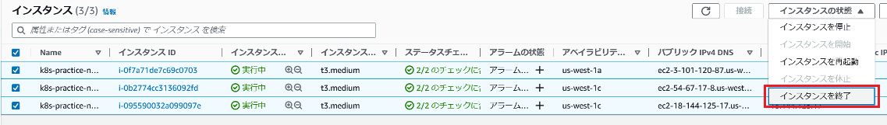

# 回答例

## Calicoのデプロイ

1. 以下のコマンドを実行してください。

   ``` sh
   kubectl delete daemonset -n kube-system aws-node
   ```

【回答例】

   ```bash
   # 実行結果
   daemonset.apps "aws-node" deleted
   ```

1. 以下のコマンドを実行してください。

   ``` sh
   kubectl apply -f https://raw.githubusercontent.com/projectcalico/calico/v3.25.0/manifests/calico-vxlan.yaml
   ```

【回答例】

   ```bash
   # 実行結果
   poddisruptionbudget.policy/calico-kube-controllers created
   serviceaccount/calico-kube-controllers created
   serviceaccount/calico-node created
   configmap/calico-config created
   customresourcedefinition.apiextensions.k8s.io/bgpconfigurations.crd.projectcalico.org created
   customresourcedefinition.apiextensions.k8s.io/bgppeers.crd.projectcalico.org created
   customresourcedefinition.apiextensions.k8s.io/blockaffinities.crd.projectcalico.org created
   customresourcedefinition.apiextensions.k8s.io/caliconodestatuses.crd.projectcalico.org created
   customresourcedefinition.apiextensions.k8s.io/clusterinformations.crd.projectcalico.org created
   customresourcedefinition.apiextensions.k8s.io/felixconfigurations.crd.projectcalico.org created
   customresourcedefinition.apiextensions.k8s.io/globalnetworkpolicies.crd.projectcalico.org created
   customresourcedefinition.apiextensions.k8s.io/globalnetworksets.crd.projectcalico.org created
   customresourcedefinition.apiextensions.k8s.io/hostendpoints.crd.projectcalico.org created
   customresourcedefinition.apiextensions.k8s.io/ipamblocks.crd.projectcalico.org created
   customresourcedefinition.apiextensions.k8s.io/ipamconfigs.crd.projectcalico.org created
   customresourcedefinition.apiextensions.k8s.io/ipamhandles.crd.projectcalico.org created
   customresourcedefinition.apiextensions.k8s.io/ippools.crd.projectcalico.org created
   customresourcedefinition.apiextensions.k8s.io/ipreservations.crd.projectcalico.org created
   customresourcedefinition.apiextensions.k8s.io/kubecontrollersconfigurations.crd.projectcalico.org created
   customresourcedefinition.apiextensions.k8s.io/networkpolicies.crd.projectcalico.org created
   customresourcedefinition.apiextensions.k8s.io/networksets.crd.projectcalico.org created
   clusterrole.rbac.authorization.k8s.io/calico-kube-controllers created
   clusterrole.rbac.authorization.k8s.io/calico-node created
   clusterrolebinding.rbac.authorization.k8s.io/calico-kube-controllers created
   clusterrolebinding.rbac.authorization.k8s.io/calico-node created
   daemonset.apps/calico-node created
   deployment.apps/calico-kube-controllers created
   ```

1. 以下のコマンドを実行してください。

   ``` sh
   kubectl -n kube-system set env daemonset/calico-node FELIX_AWSSRCDSTCHECK=Disable
   ```

【回答例】

   ```bash
   # 実行結果
   $ kubectl -n kube-system set env daemonset/calico-node FELIX_AWSSRCDSTCHECK=Disable
   daemonset.apps/calico-node env updated
   ```

1. ワーカーノードを再作成してください。

【回答例】

   

   > :information_source:  
   > AutoScalingグループの機能により、自動的に再作成されます。

## NetworkPolicy(Namespace単位)

1. 以下を満たすマニフェストを作成しデプロイしてください。

   - 要件
     - 1セット目
       - Namespace
         - 1セット目とわかる名前にする。
         - 1セット目とわかるラベルをつける
       - Deployment
         - １つ目
           - namespaceは1セット目
           - 1つ目のDeployment固有のラベルをつける
           - nginx:1.12のコンテナ
           - /usr/share/nginx/html/index.htmlの内容を1つ目のアプリケーションであることがわかる内容に書き換える
         - 2つ目
           - namespaceは1セット目
           - 2つ目のDeployment固有のラベルをつける
           - curlが実行できるコンテナ
       - Service
         - namespaceは1セット目
         - 上記1つ目のDeploymentをClusterIPのPort:80で公開
     - 2セット目
       - 1セット目と基本同じでNamespaceの名前、ラベルとindex.htmlの内容を変える

   【回答例】

   ```yml
   # manifest
   ## 1セット目
   apiVersion: v1
   kind: Namespace
   metadata:
     name: calico-1
     labels:
       ns: calico-1
   ---
   apiVersion: apps/v1
   kind: Deployment
   metadata:
     name: calico-1-nginx
     namespace: calico-1
   spec:
     replicas: 1
     selector:
       matchLabels:
         app: calico-1-nginx
     template:
       metadata:
         labels:
           app: calico-1-nginx
       spec:
         containers:
           - name: calico-1-nginx
             image: nginx:1.12
             lifecycle:
               postStart:
                 exec:
                   command:
                     ["/bin/sh", "-c", "echo calico-1 > /usr/share/nginx/html/index.html"]
   ---
   apiVersion: v1
   kind: Service
   metadata:
     name: calico-1-nginx-svc
     namespace: calico-1
   spec:
     ports:
       - name: "http-port"
         protocol: "TCP"
         port: 80
         targetPort: 80
     selector:
       app: calico-1-nginx
   ```

   ```yml
   # manifest
   ## 2セット目
   apiVersion: v1
   kind: Namespace
   metadata:
     name: calico-2
     labels:
       ns: calico-2
   ---
   apiVersion: apps/v1
   kind: Deployment
   metadata:
     name: calico-2-nginx
     namespace: calico-2
   spec:
     replicas: 1
     selector:
       matchLabels:
         app: calico-2-nginx
     template:
       metadata:
         labels:
           app: calico-2-nginx
       spec:
         containers:
           - name: calico-2-nginx
             image: nginx:1.12
             lifecycle:
               postStart:
                 exec:
                   command:
                     ["/bin/sh", "-c", "echo calico-2 > /usr/share/nginx/html/index.html"]
   ---
   apiVersion: v1
   kind: Service
   metadata:
     name: calico-2-nginx-svc
     namespace: calico-2
   spec:
     ports:
       - name: "http-port"
         protocol: "TCP"
         port: 80
         targetPort: 80
     selector:
       app: calico-2-nginx
   ```

   ```bash
   # 実行結果
   $ kubectl apply -f calico-1-nginx.yaml
   namespace/calico-1 created
   deployment.apps/calico-1-nginx created
   service/calico-1-nginx-svc created

   $ kubectl apply -f calico-2-nginx.yaml
   namespace/calico-2 created
   deployment.apps/calico-2-nginx created
   service/calico-2-nginx-svc created
   ```

1. 各NamespaceのcurlできるPodから各NamespaceのService:nginxに`通信可能`であることを確認してください。（計4回curlします。他Namespaceへcurlする場合、<Service名>.<Namespace名>でアクセス可能です。）

   【回答例】

   ```bash
   # 実行結果
   ## testpod 作成
   $ kubectl run --image=appropriate/curl --restart=Never --namespace=calico-1 testpod-1 sleep 3600
   pod/testpod-1 created
   $ kubectl run --image=appropriate/curl --restart=Never --namespace=calico-2 testpod-2 sleep 3600
   pod/testpod-2 created

   ## calico-1 ⇒ calico-1
   $ kubectl exec testpod-1 -n calico-1 -- curl -s http://calico-1-nginx-svc
   calico-1

   ## calico-1 ⇒ calico-2
   $ kubectl exec testpod-1 -n calico-1 -- curl -s http://calico-2-nginx-svc.calico-2
   calico-2

   ## calico-2 ⇒ calico-2
   $ kubectl exec testpod-2 -n calico-2 -- curl -s http://calico-2-nginx-svc
   calico-2

   ## calico-2 ⇒ calico-1
   $ kubectl exec testpod-2 -n calico-2 -- curl -s http://calico-1-nginx-svc.calico-1
   calico-1
   ```

1. 以下を満たすマニフェストを作成しデプロイしてください。NetworkPolicyリソースについては[公式ドキュメント][2]を参考にしてください。

   - 要件
      - 1セット目
        - NetworkPolicy
          - 対象は同じnamespaceのPodすべて
          - 1セット目のNamespaceからのインバウンド通信を許可する。（言い方を変えると1セット目のNamespace以外からの通信を許可しない）
      - 2セット目
        - 1セット目と基本同じで2セット目のNamespaceからのインバウンド通信のみを許可する。

   【回答例】

   ```yml
   # manifest
   ## 1セット目
   apiVersion: networking.k8s.io/v1
   kind: NetworkPolicy
   metadata:
     name: calico-1-networkpolicy
     namespace: calico-1
   spec:
     podSelector:
       matchLabels:
         app: calico-1-nginx
     policyTypes:
       - Ingress
     ingress:
       - from:
           - namespaceSelector:
               matchLabels:
                 ns: calico-1
   ```

   ```yml
   # manifest
   ## 2セット目
   apiVersion: networking.k8s.io/v1
   kind: NetworkPolicy
   metadata:
     name: calico-2-networkpolicy
     namespace: calico-2
   spec:
     podSelector:
       matchLabels:
         app: calico-2-nginx
     policyTypes:
       - Ingress
     ingress:
       - from:
           - namespaceSelector:
               matchLabels:
                 ns: calico-2
   ```

   ```bash
   # 実行結果
   $ kubectl apply -f calico-1-networkpolicy.yaml
   networkpolicy.networking.k8s.io/calico-1-networkpolicy created

   $ kubectl apply -f calico-2-networkpolicy.yaml
   networkpolicy.networking.k8s.io/calico-2-networkpolicy created
   ```

1. 各NamespaceのPod:curlから各NamespaceのService:nginxに`curl -s -m 10`で通信してください。-mはタイムアウト値(秒)を指定するオプションです。  
   Namespaceを跨いだ通信は失敗することを確認してください。

   【回答例】

   ```bash
   # 実行結果
   ## calico-1 ⇒ calico-1
   $ kubectl exec testpod-1 -n calico-1 -- curl -s -m 10 http://calico-1-nginx-svc
   calico-1

   ## calico-1 ⇒ calico-2
   $ kubectl exec testpod-1 -n calico-1 -- curl -v -s -m 10 http://calico-2-nginx-svc.calico-2
   * Rebuilt URL to: http://calico-2-nginx-svc.calico-2/
   *   Trying 10.100.162.160...
   * TCP_NODELAY set
   * Connection timed out after 10000 milliseconds
   * Closing connection 0
   command terminated with exit code 28

   ## calico-2 ⇒ calico-2
   $ kubectl exec testpod-2 -n calico-2 -- curl -s -m 10 http://calico-2-nginx-svc
   calico-2

   ## calico-2 ⇒ calico-1
   $ kubectl exec testpod-2 -n calico-2 -- curl -v -s -m 10 http://calico-1-nginx-svc.calico-1
   * Rebuilt URL to: http://calico-1-nginx-svc.calico-1/
   *   Trying 10.100.63.22...
   * TCP_NODELAY set
   * Connection timed out after 10001 milliseconds
   * Closing connection 0
   command terminated with exit code 28
   ```

1. 作成した`NetworkPolicy`を削除してください。

   【回答例】

   ```bash
   # 実行結果
   $ kubectl delete -f calico-1-networkpolicy.yaml
   networkpolicy.networking.k8s.io/calico-1-networkpolicy deleted

   $ kubectl deleted -f calico-2-networkpolicy.yaml
   networkpolicy.networking.k8s.io/calico-2-networkpolicy deleted
   ```

## NetworkPolicy(Pod単位)

1. 以下を満たすマニフェストを作成しデプロイしてください。

   - 要件
      - Deployment
        - 3つ目
          - 3つ目のDeployment固有のラベルをつける
          - curlが実行できるコンテナ
      - NetworkPolicy
        - 対象は1つ目のDeployment
        - 3つ目のDeploymentのみ通信を許可する。

   【回答例】

   ```yml
   # manifest
   apiVersion: v1
   kind: Namespace
   metadata:
     name: calico-3
     labels:
       ns: calico-3
   ---
   apiVersion: apps/v1
   kind: Deployment
   metadata:
     name: calico-3-curl
     namespace: calico-3
   spec:
     replicas: 1
     selector:
       matchLabels:
         app: calico-3-curl
     template:
       metadata:
         labels:
           app: calico-3-curl
       spec:
         containers:
           - name: calico-3-curl
             image: appropriate/curl
             command: ["/bin/sh", "-c", "sleep 3600"]
   ---
   apiVersion: networking.k8s.io/v1
   kind: NetworkPolicy
   metadata:
     name: calico-1-networkpolicy
     namespace: calico-1
   spec:
     podSelector:
       matchLabels:
         app: calico-1-nginx
     policyTypes:
       - Ingress
     ingress:
       - from:
           - namespaceSelector:
               matchLabels:
                 ns: calico-3
           - podSelector:
               matchLabels:
                 app: calico-3-curl
   ```

   ```bash
   # 実行結果
   $ kubectl apply -f calico-3.yaml
   namespace/calico-3 created
   deployment.apps/calico-3-nginx created
   networkpolicy.networking.k8s.io/calico-3-networkpolicy created
   ```

1. 2つ目と3つ目のDeploymentでデプロイしたPodからService:nginxに対して通信してください。3つ目でデプロイしたPodからのみアクセスできることを確認してください。（もしできてしまう場合、同一Namespaceからの通信を許可するNetworkPolicyが残っていないか確認し、残っていれば削除する）

   【回答例】

   ```bash
   # 実行結果
   $ kubectl get pod -n calico-3
   NAME                             READY   STATUS    RESTARTS   AGE
   calico-3-curl-6b6b646dc7-ctw9p   1/1     Running   0          7s


   ## calico-2 ⇒ calico-1
   $ kubectl exec testpod-2 -n calico-2 -- curl -v -s -m 10 http://calico-1-nginx-svc.calico-1
   * Rebuilt URL to: http://calico-1-nginx-svc.calico-1/
   *   Trying 10.100.63.22...
   * TCP_NODELAY set
   * Connection timed out after 10001 milliseconds
   * Closing connection 0
   command terminated with exit code 28

   $ kubectl exec calico-3-curl-6b6b646dc7-ctw9p -n calico-3 -- curl -s -m 10 http://calico-1-nginx-svc.calico-1
   calico-1
   ```

1. 作成したリソースを削除してください。

   【回答例】

   ```bash
   # 実行結果
   $ kubectl delete -f calico-3.yaml
   namespace "calico-3" deleted
   deployment.apps "calico-3-curl" deleted
   networkpolicy.networking.k8s.io "calico-1-networkpolicy" deleted

   $ kubectl delete -f calico-1-nginx.yaml
   namespace "calico-1" deleted
   deployment.apps "calico-1-nginx" deleted
   service "calico-1-nginx-svc" deleted

   $ kubectl delete -f calico-2-nginx.yaml
   namespace "calico-2" deleted
   deployment.apps "calico-2-nginx" deleted
   service "calico-2-nginx-svc" deleted
   ```

[2]:https://kubernetes.io/docs/concepts/services-networking/network-policies/
