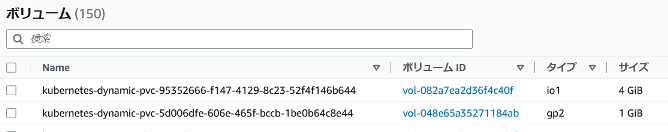

# 回答例

1. 以下を満たすマニフェストを作成しデプロイしてください。StorageClassリソースについては[公式ドキュメント][2]を参考にしてください。なお、デプロイする際は必ずStorageClassを最初にデプロイするように注意してください。

   - 要件
     - StorageClass
       - 名前はio1
       - ebsのprovisionerを使用
       - reclaimPolicyはDelete
     - Deployment
       - イメージは何でもよい
       - volumeMountsで2つのボリュームを別々の適当なpathにマウントしてください。
       - volumeで以下2つのpvcをそれぞれ指定してください。
         - normal-disk-pvc
         - fast-disk-pvc
     - PVC
       - normal-disk-pvc
         - storageClassNameはデフォルト
         - readwriteonce
         - 容量: 1G
       - fast-disk-pvc
         - storageClassNameはio1
         - readwriteonce
         - 容量: 4G

   【回答例】

   ```yml
   # manifest
   apiVersion: storage.k8s.io/v1
   kind: StorageClass
   metadata:
     name: io1
   provisioner: kubernetes.io/aws-ebs
   parameters:
     type: io1
   reclaimPolicy: Delete
   ---
   apiVersion: apps/v1
   kind: Deployment
   metadata:
     name: storage-nginx
   spec:
     replicas: 1
     selector:
       matchLabels:
         app: storage-nginx
     template:
       metadata:
         labels:
           app: storage-nginx
       spec:
         containers:
           - name: storage-nginx
             image: nginx:1.12
             volumeMounts:
             - mountPath: /tmp
               name: fast-disk-pvc
             - mountPath: /usr/share/nginx/html
               name: normal-disk-pvc
         volumes:
           - name: fast-disk-pvc
             persistentVolumeClaim:
               claimName: fast-disk-pvc
           - name: normal-disk-pvc
             persistentVolumeClaim:
               claimName: normal-disk-pvc
   ---
   apiVersion: v1
   kind: PersistentVolumeClaim
   metadata:
     name: fast-disk-pvc
   spec:
     storageClassName: io1
     accessModes:
     - ReadWriteOnce
     resources:
       requests:
         storage: 4Gi
   ---
   apiVersion: v1
   kind: PersistentVolumeClaim
   metadata:
     name: normal-disk-pvc
   spec:
     accessModes:
     - ReadWriteOnce
     resources:
       requests:
         storage: 1Gi
   ```

   ```bash
   # 実行結果
   $ kubectl apply -f storageclass-nginx.yaml
   storageclass.storage.k8s.io/io1 unchanged
   deployment.apps/storage-nginx created
   persistentvolumeclaim/fast-disk-pvc created
   persistentvolumeclaim/normal-disk-pvc created
   ```

1. 作成したオブジェクトを確認してください。なお、StorageClassのgp2はデフォルトで作成されているものです。

   【回答例】

   ```bash
   # 実行結果
   $ kubectl get storageclass,pv,pvc
   NAME                                        PROVISIONER             RECLAIMPOLICY   VOLUMEBINDINGMODE      ALLOWVOLUMEEXPANSION   AGE
   storageclass.storage.k8s.io/gp2 (default)   kubernetes.io/aws-ebs   Delete          WaitForFirstConsumer   false                  17m
   storageclass.storage.k8s.io/io1             kubernetes.io/aws-ebs   Delete          Immediate              false                  3m46s

   NAME                                                        CAPACITY   ACCESS MODES   RECLAIM POLICY   STATUS   CLAIM                     STORAGECLASS   REASON   AGE
   persistentvolume/pvc-5d006dfe-606e-465f-bccb-1be0b64c8e44   1Gi        RWO            Delete           Bound    default/normal-disk-pvc   gp2                     19s
   persistentvolume/pvc-95352666-f147-4129-8c23-52f4f146b644   4Gi        RWO            Delete           Bound    default/fast-disk-pvc     io1                     29s

   NAME                                    STATUS   VOLUME                                     CAPACITY   ACCESS MODES   STORAGECLASS   AGE
   persistentvolumeclaim/fast-disk-pvc     Bound    pvc-95352666-f147-4129-8c23-52f4f146b644   4Gi        RWO            io1            34s
   persistentvolumeclaim/normal-disk-pvc   Bound    pvc-5d006dfe-606e-465f-bccb-1be0b64c8e44   1Gi        RWO            gp2            34s

   TS@DESKTOP MINGW64 /e/Repositories/k8s-manifest/3.Advanced
   $ kubectl get storageclass,pv,pvc,deploy
   NAME                                        PROVISIONER             RECLAIMPOLICY   VOLUMEBINDINGMODE      ALLOWVOLUMEEXPANSION   AGE
   storageclass.storage.k8s.io/gp2 (default)   kubernetes.io/aws-ebs   Delete          WaitForFirstConsumer   false                  17m
   storageclass.storage.k8s.io/io1             kubernetes.io/aws-ebs   Delete          Immediate              false                  4m14s

   NAME                                                        CAPACITY   ACCESS MODES   RECLAIM POLICY   STATUS   CLAIM                     STORAGECLASS   REASON   AGE
   persistentvolume/pvc-5d006dfe-606e-465f-bccb-1be0b64c8e44   1Gi        RWO            Delete           Bound    default/normal-disk-pvc   gp2                     47s
   persistentvolume/pvc-95352666-f147-4129-8c23-52f4f146b644   4Gi        RWO            Delete           Bound    default/fast-disk-pvc     io1                     57s

   NAME                                    STATUS   VOLUME                                     CAPACITY   ACCESS MODES   STORAGECLASS   AGE
   persistentvolumeclaim/fast-disk-pvc     Bound    pvc-95352666-f147-4129-8c23-52f4f146b644   4Gi        RWO            io1            62s
   persistentvolumeclaim/normal-disk-pvc   Bound    pvc-5d006dfe-606e-465f-bccb-1be0b64c8e44   1Gi        RWO            gp2            62s

   NAME                            READY   UP-TO-DATE   AVAILABLE   AGE
   deployment.apps/storage-nginx   1/1     1            1           64s
   ```

1. マネジメントコンソールからEBSを確認し、gp2とio1のボリュームがあることを確認してください。

   【回答例】

   

1. 作成したリソースを削除してください。

   【回答例】

   ```bash
   # 実行結果
   $ kubectl delete -f storageclass-nginx.yaml
   storageclass.storage.k8s.io "io1" deleted
   deployment.apps "storage-nginx" deleted
   persistentvolumeclaim "fast-disk-pvc" deleted
   persistentvolumeclaim "normal-disk-pvc" deleted
   ```

[2]:https://kubernetes.io/docs/concepts/storage/storage-classes/
