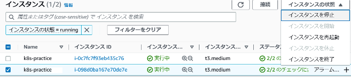

# 回答例

1. ワーカーノード2台の状態から作業する。

   【回答例】

   ```bash
   # 実行結果
   $ kubectl get node
   NAME                                          STATUS   ROLES    AGE     VERSION
   ip-192-168-33-14.us-west-1.compute.internal   Ready    <none>   9m43s   v1.22.17-eks-48e63af
   ip-192-168-8-200.us-west-1.compute.internal   Ready    <none>   17m     v1.22.17-eks-48e63af
   ```

1. 以下を満たすマニフェストを作成しデプロイしてください。

   - 要件
     - Deployment
       - イメージは何でもよい
       - replicas:10

   【回答例】

   ```yml
   # manifest
   apiVersion: apps/v1
   kind: Deployment
   metadata:
     name: nginx
   spec:
     replicas: 10
     selector:
       matchLabels:
         app: nginx
     template:
       metadata:
         labels:
           app: nginx
       spec:
         containers:
           - name: nginx
             image: nginx:1.12
             ports:
               - containerPort: 80
   ```

   ```bash
   # 実行結果
   $ kubectl apply -f descheduler-nginx.yaml
   deployment.apps/nginx created
   ```

1. 各Podが起動しているノードを一覧で表示し、2つのノードに分散配置されていることを確認してください。

   【回答例】

   ```bash
   # 実行結果
   $ kubectl get pod -o wide --sort-by=.spec.nodeName
   NAME                    READY   STATUS    RESTARTS   AGE   IP               NODE                                          NOMINATED NODE   READINESS GATES
   nginx-f77774fc5-bpmnm   1/1     Running   0          31s   192.168.3.60     ip-192-168-8-200.us-west-1.compute.internal   <none>           <none>
   nginx-f77774fc5-xzw6d   1/1     Running   0          31s   192.168.15.168   ip-192-168-8-200.us-west-1.compute.internal   <none>           <none>
   nginx-f77774fc5-jkc2g   1/1     Running   0          31s   192.168.3.26     ip-192-168-8-200.us-west-1.compute.internal   <none>           <none>
   nginx-f77774fc5-s4w6x   1/1     Running   0          31s   192.168.1.12     ip-192-168-8-200.us-west-1.compute.internal   <none>           <none>
   nginx-f77774fc5-z8bzs   1/1     Running   0          31s   192.168.18.247   ip-192-168-8-200.us-west-1.compute.internal   <none>           <none>
   nginx-f77774fc5-6bp2l   1/1     Running   0          31s   192.168.48.124   ip-192-168-33-14.us-west-1.compute.internal   <none>           <none>
   nginx-f77774fc5-smn6c   1/1     Running   0          31s   192.168.40.214   ip-192-168-33-14.us-west-1.compute.internal   <none>           <none>
   nginx-f77774fc5-vp6h5   1/1     Running   0          31s   192.168.61.115   ip-192-168-33-14.us-west-1.compute.internal   <none>           <none>
   nginx-f77774fc5-x8m67   1/1     Running   0          31s   192.168.49.163   ip-192-168-33-14.us-west-1.compute.internal   <none>           <none>
   nginx-f77774fc5-hzsz4   1/1     Running   0          31s   192.168.55.142   ip-192-168-33-14.us-west-1.compute.internal   <none>           <none>
   ```

1. どちらかのノードを停止してください。（停止の方法は何でも良いです）

   【回答例】

   

1. ノード停止から1分ほどしてからPodの起動ノードを確認してください。1つのノードに片寄って配置されていることを確認してください。

   【回答例】

   ```bash
   # 実行結果
   $ kubectl get pod -o wide --sort-by=.spec.nodeName
   NAME                    READY   STATUS        RESTARTS   AGE   IP               NODE                                          NOMINATED NODE   READINESS GATES
   nginx-f77774fc5-s4w6x   1/1     Running       0          19m   192.168.1.12     ip-192-168-8-200.us-west-1.compute.internal   <none>           <none>
   nginx-f77774fc5-z8bzs   1/1     Running       0          19m   192.168.18.247   ip-192-168-8-200.us-west-1.compute.internal   <none>           <none>
   nginx-f77774fc5-bpmnm   1/1     Running       0          19m   192.168.3.60     ip-192-168-8-200.us-west-1.compute.internal   <none>           <none>
   nginx-f77774fc5-xzw6d   1/1     Running       0          19m   192.168.15.168   ip-192-168-8-200.us-west-1.compute.internal   <none>           <none>
   nginx-f77774fc5-jkc2g   1/1     Running       0          19m   192.168.3.26     ip-192-168-8-200.us-west-1.compute.internal   <none>           <none>
   nginx-f77774fc5-kvkbf   1/1     Running       0          55s   192.168.23.118   ip-192-168-8-200.us-west-1.compute.internal   <none>           <none>
   nginx-f77774fc5-nlhc8   1/1     Running       0          56s   192.168.26.109   ip-192-168-8-200.us-west-1.compute.internal   <none>           <none>
   nginx-f77774fc5-rdw4b   1/1     Running       0          56s   192.168.19.27    ip-192-168-8-200.us-west-1.compute.internal   <none>           <none>
   nginx-f77774fc5-2pjmg   1/1     Running       0          55s   192.168.17.44    ip-192-168-8-200.us-west-1.compute.internal   <none>           <none>
   nginx-f77774fc5-zwdzr   1/1     Running       0          56s   192.168.0.199    ip-192-168-8-200.us-west-1.compute.internal   <none>           <none>
   ```

1. ワーカーノードを1台クラスタに再参加さしてください。（ワーカーをAutoScalingGroupで構成している場合、しばらく待っていれば自動的に追加されると思います。）

   【回答例】

   

1. ワーカー2台の状態に戻ってもPodの起動ノードが片寄った状態のままで有ることを確認してください。

   【回答例】

   ```bash
   # 実行結果
   $ kubectl get node
   NAME                                          STATUS   ROLES    AGE     VERSION
   ip-192-168-50-70.us-west-1.compute.internal   Ready    <none>   3m47s   v1.22.17-eks-48e63af
   ip-192-168-8-200.us-west-1.compute.internal   Ready    <none>   42m     v1.22.17-eks-48e63af

   $ kubectl get pod -o wide --sort-by=.spec.nodeName
   $ kubectl get pod -o wide --sort-by=.spec.nodeName
   NAME                    READY   STATUS        RESTARTS   AGE     IP               NODE                                          NOMINATED NODE   READINESS GATES
   nginx-f77774fc5-s4w6x   1/1     Running       0          23m     192.168.1.12     ip-192-168-8-200.us-west-1.compute.internal   <none>           <none>
   nginx-f77774fc5-z8bzs   1/1     Running       0          23m     192.168.18.247   ip-192-168-8-200.us-west-1.compute.internal   <none>           <none>
   nginx-f77774fc5-bpmnm   1/1     Running       0          23m     192.168.3.60     ip-192-168-8-200.us-west-1.compute.internal   <none>           <none>
   nginx-f77774fc5-xzw6d   1/1     Running       0          23m     192.168.15.168   ip-192-168-8-200.us-west-1.compute.internal   <none>           <none>
   nginx-f77774fc5-jkc2g   1/1     Running       0          23m     192.168.3.26     ip-192-168-8-200.us-west-1.compute.internal   <none>           <none>
   nginx-f77774fc5-kvkbf   1/1     Running       0          4m43s   192.168.23.118   ip-192-168-8-200.us-west-1.compute.internal   <none>           <none>
   nginx-f77774fc5-nlhc8   1/1     Running       0          4m44s   192.168.26.109   ip-192-168-8-200.us-west-1.compute.internal   <none>           <none>
   nginx-f77774fc5-rdw4b   1/1     Running       0          4m44s   192.168.19.27    ip-192-168-8-200.us-west-1.compute.internal   <none>           <none>
   nginx-f77774fc5-2pjmg   1/1     Running       0          4m43s   192.168.17.44    ip-192-168-8-200.us-west-1.compute.internal   <none>           <none>
   nginx-f77774fc5-zwdzr   1/1     Running       0          4m44s   192.168.0.199    ip-192-168-8-200.us-west-1.compute.internal   <none>           <none>
   ```

1. 以下コマンドで必要なマニフェストが含まれるgitリポジトリをクローンしてください。

   ``` sh
   git clone https://github.com/kubernetes-sigs/descheduler.git
   ```

   【回答例】

   ```bash
   # 実行結果
   $ git clone https://github.com/kubernetes-sigs/descheduler.git
   Cloning into 'descheduler'...
   remote: Enumerating objects: 86882, done.
   remote: Counting objects: 100% (195/195), done.
   remote: Compressing objects: 100% (141/141), done.
   remote: Total 86882 (delta 66), reused 132 (delta 45), pack-reused 86687Receiving objects: 100% (86882/86882), 84.69 MiB | 10.87 MiB/s
   Receiving objects: 100% (86882/86882), 86.44 MiB | 10.57 MiB/s, done.
   Resolving deltas: 100% (47247/47247), done.
   Updating files: 100% (5917/5917), done.
   ```

1. 以下コマンドで必要なマニフェストをapply

   ``` sh
   kubectl create -f kubernetes/base/rbac.yaml
   kubectl create -f kubernetes/base/configmap.yaml
   kubectl create -f kubernetes/cronjob/cronjob.yaml
   ```

   【回答例】

   ```bash
   # 実行結果
   $ cd descheduler/

   $ kubectl create -f kubernetes/base/rbac.yaml
   clusterrole.rbac.authorization.k8s.io/descheduler-cluster-role created
   serviceaccount/descheduler-sa created
   clusterrolebinding.rbac.authorization.k8s.io/descheduler-cluster-role-binding created

   $ kubectl create -f kubernetes/base/configmap.yaml
   configmap/descheduler-policy-configmap created

   $ kubectl create -f kubernetes/cronjob/cronjob.yaml
   cronjob.batch/descheduler-cronjob created
   ```

1. 2分ほどたってからPodの起動ノードを確認し、2ノードに分散されていることを確認してください。

   【回答例】

   ```bash
   # 実行結果
   $ kubectl get pod -o wide --sort-by=.spec.nodeName
   NAME                    READY   STATUS        RESTARTS   AGE    IP               NODE                                          NOMINATED NODE   READINESS GATES
   nginx-f77774fc5-jkc2g   1/1     Running       0          33m    192.168.3.26     ip-192-168-8-200.us-west-1.compute.internal   <none>           <none>
   nginx-f77774fc5-xzw6d   1/1     Running       0          33m    192.168.15.168   ip-192-168-8-200.us-west-1.compute.internal   <none>           <none>
   nginx-f77774fc5-s4w6x   1/1     Running       0          33m    192.168.1.12     ip-192-168-8-200.us-west-1.compute.internal   <none>           <none>
   nginx-f77774fc5-rdw4b   1/1     Running       0          15m    192.168.19.27    ip-192-168-8-200.us-west-1.compute.internal   <none>           <none>
   nginx-f77774fc5-zwdzr   1/1     Running       0          15m    192.168.0.199    ip-192-168-8-200.us-west-1.compute.internal   <none>           <none>
   nginx-f77774fc5-hgm7x   1/1     Running       0          2m9s   192.168.48.186   ip-192-168-50-70.us-west-1.compute.internal   <none>           <none>
   nginx-f77774fc5-v47g6   1/1     Running       0          2m9s   192.168.35.202   ip-192-168-50-70.us-west-1.compute.internal   <none>           <none>
   nginx-f77774fc5-j8z8z   1/1     Running       0          2m9s   192.168.34.245   ip-192-168-50-70.us-west-1.compute.internal   <none>           <none>
   nginx-f77774fc5-h4mzm   1/1     Running       0          2m9s   192.168.52.22    ip-192-168-50-70.us-west-1.compute.internal   <none>           <none>
   nginx-f77774fc5-s8tqv   1/1     Running       0          2m9s   192.168.51.60    ip-192-168-50-70.us-west-1.compute.internal   <none>           <none>
   ```

1. 作成したリソースを削除してください。

   【回答例】

   ```bash
   # 実行結果
   $ kubectl delete -f descheduler-nginx.yaml
   deployment.apps "nginx" deleted

   $ kubectl delete -f kubernetes/base/rbac.yaml
   clusterrole.rbac.authorization.k8s.io "descheduler-cluster-role" deleted
   serviceaccount "descheduler-sa" deleted
   clusterrolebinding.rbac.authorization.k8s.io "descheduler-cluster-role-binding" deleted

   $ kubectl delete -f kubernetes/base/configmap.yaml
   configmap "descheduler-policy-configmap" deleted

   $ kubectl delete -f kubernetes/cronjob/cronjob.yaml
   cronjob.batch "descheduler-cronjob" deleted
   ```
